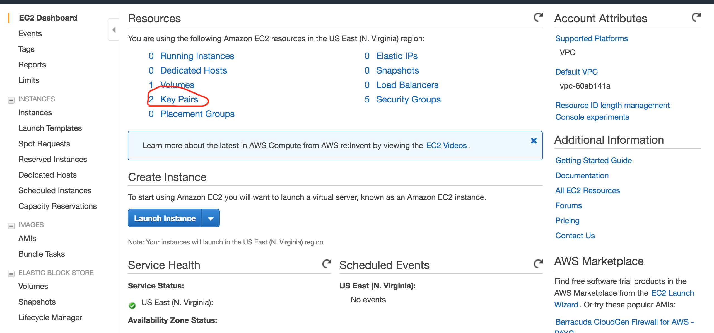
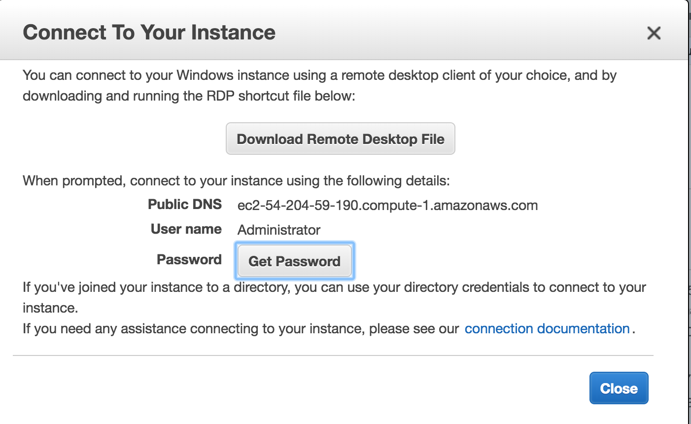
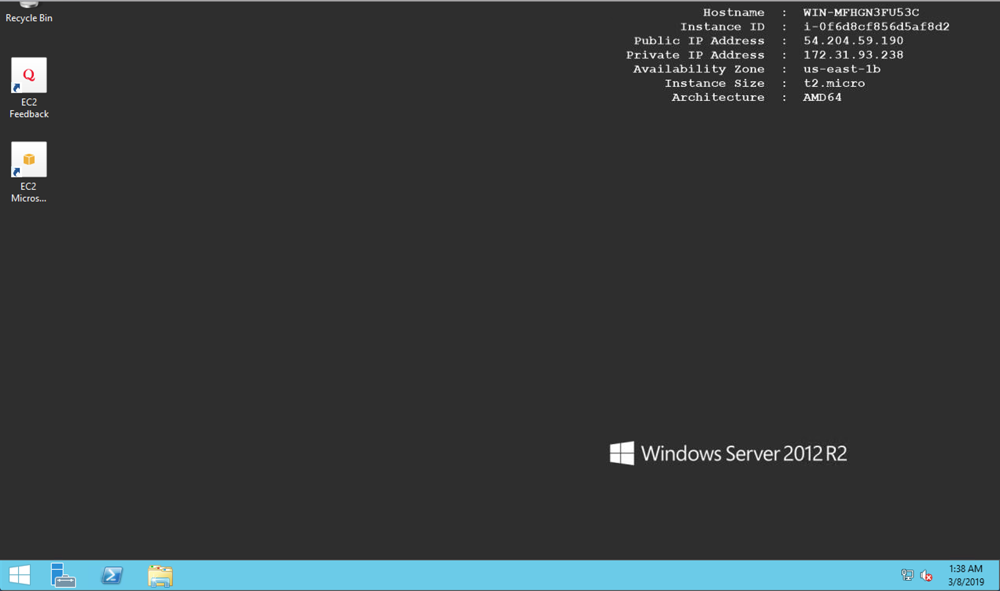

In the [last lesson/lab ](lesson1-ec2-with-terraform.MD), we launched a basic EC2 instance with terraform. 
In this lab, we will launch linux EC2 instance and ssh, and then launch a windows EC2 instane and RDP into it. Please go to  [last lesson/lab ](lesson1-ec2-with-terraform.MD) if you haven't gone throught it . We introduce terraform in that lesosn. 


## Steps: 

1) Go to your AWS Management Console , navigate to the EC2 dashboard, click on Key Pairs. Click Create Key Pair. Enter a name like terraform-key and click create. 



This will download a file to your computers default downloads folder. 

2) On the EC2 Dashboard , click launch instance,  and find a Windows 2012( or any windows AMI)  AMI on your selected region. Note down the AMI id. On us-east-1 region I chose Microsoft Windows Server 2012 R2 Base - **ami-066663db63b3aa675**
2) Create a new folder, copy the downloaded key file to this folder. In the same folder create a text file with a name like windows.tf and paste this code. Note this is very similar to last lessons code. Replace the ami-id if you're in a different region.
```HCL
provider "aws" {
  access_key = "ACCESS_KEY_HERE"
  secret_key = "SECRET_KEY_HERE"
  region     = "us-east-1"
}

resource "aws_instance" "example" {
  ami           = "ami-066663db63b3aa675"
  instance_type = "t2.micro"
  key_name = "terraform-key"
  security_groups = ["${aws_security_group.allow_rdp.name}"]

}

resource "aws_security_group" "allow_rdp" {
  name        = "allow_rdp"
  description = "Allow ssh traffic"


  ingress {

    from_port   = 3389 #  By default, the windows server listens on TCP port 3389 for RDP
    to_port     = 3389
    protocol =   "tcp"

    cidr_blocks =  ["0.0.0.0/0"]
  }
}
```

3) After you create the windows.tf file. Save it .Make sure you have AWS your Credentials entered properly.  Then use this command to launch the terraform stack 
```
terraform apply --auto-approve 
```

Auto approve flag skips the yes/no question whether if you want to create the stack or not. 

4) Go to your AWS Management Console. An EC2 should be spinning up. Wait 5 minutes( Windows instaces take around 5 mins to get ready) . Then select the EC2 Instance and click on connect. 
- Click Decrypt passoword. 
- Choose your .pem file you downloaded earlier and upload it to decrypt the password
- Once you get the password , download the RDP file
- Open the downloaded RDP file. You will be asked for the pasword when Windows Remote desktop opens. Supply the pass. Note: If you don't have Remote Desktop Installed, you many need to install it. 




5) You should be logged in now. 

6) In our configuration file , let's change the AMI to a Linux AMI, and add port 22 on our SG instead of 3389. Then initialize the terraform working directory again and apply the configuration. 
7) This should delete the windows instance and create a Linux instance. 
8) Let's verify that the linux windows is running. Then let's SSH into the linux instance. 


## New Concepts introduced
- How to create Security Groups 
- resource dependency. We refer to the SG with **aws_security_group.example.id**

